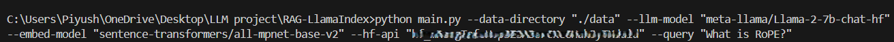

# Research Paper Querying Tool 🤖

This repository provides a **Research Paper Querying Tool** powered by **LLaMA-2-7B** and **RAG (Retrieval-Augmented Generation) architecture**, allowing users to efficiently query research papers and receive accurate, contextually relevant answers. The tool leverages LLaMA-2-7B for language generation and the **sentence-transformers/all-mpnet-base-v2** model for embedding representations, making it highly suitable for academic research and document analysis.

## Features 🌟

- **RAG Architecture**: Combines a language model with a retrieval mechanism to provide precise, context-aware answers.
- **LLaMA-2-7B**: Utilizes the meta-llama/Llama-2-7b-chat-hf model for answering questions based on retrieved documents.
- **Sentence Embeddings**: Employs the sentence-transformers/all-mpnet-base-v2 model for embedding documents, ensuring efficient and accurate retrieval.
- **Simple CLI**: Easy-to-use command-line interface for querying research papers using specified arguments.

## Requirements 🛠️

Before running the tool, make sure you have the following installed:

- **Python 3.8+**
- Install necessary dependencies by running:
  ```bash
  pip install -r requirements.txt
  ```

## Usage 💻

To query the research papers in your dataset, use the following command:

```bash
python main.py --data-directory "./data" --llm-model "meta-llama/Llama-2-7b-chat-hf" --embed-model "sentence-transformers/all-mpnet-base-v2" --hf-api "hugging_face api_key" --query "What are the number of parameters in LLaMA"
```

### Command Line Arguments:

- \`--data-directory\` (required): The path to the directory containing your research papers in \`.txt\` or \`.pdf\` format.
  
- \`--llm-model\` (required): The Hugging Face model ID for the LLaMA model. Default: \`"meta-llama/Llama-2-7b-chat-hf"\`.

- \`--embed-model\` (required): The Hugging Face model ID for the sentence embedding model. Default: \`"sentence-transformers/all-mpnet-base-v2"\`.

- \`--hf-api\` (required): Your Hugging Face API key. You can generate it from your Hugging Face account.

- \`--query\` (required): The query you want to ask about the research papers in the dataset. The model will search and return the most relevant response based on the content.


### Input Example:



### Output Example:


## Directory Structure

Your directory should look like this:

```
|-- data/
    |-- research_paper_1.pdf
    |-- research_paper_2.pdf
    |-- ...
|-- main.py
|-- requirements.txt
|-- README.md
```

- \`data/\`: This directory contains all research papers (in \`.txt\` or \`.pdf\` format) to be queried.
- \`main.py\`: The main script that executes the querying.
- \`requirements.txt\`: A file that lists all necessary Python libraries for this project.
- \`README.md\`: Documentation for setting up and using the tool.

## Dependencies

This project requires the following packages:

- **Transformers**: For working with language models (LLaMA).
- **Sentence-Transformers**: For embedding research papers.
- **PDF Processing Libraries**: To handle and convert PDF documents into text.
- **PyTorch**: For model inference.


## Hugging Face API Key

You will need a valid Hugging Face API key to access the models. You can obtain your API key from your Hugging Face account and pass it using the \`--hf-api\` flag when running the script.

## Acknowledgements

This tool uses the following models and resources:

- **[LLaMA-2-7B](https://huggingface.co/meta-llama/Llama-2-7b-chat-hf)**
- **[Sentence Transformers](https://huggingface.co/sentence-transformers/all-mpnet-base-v2)**
  
---
## Collaborators

- Niyath Nair 😸
- Piyush Hambarde 👻

Feel free to reach out for any questions or issues related to this project. Happy querying!
---


